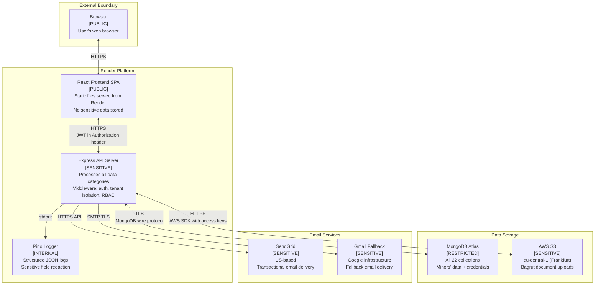
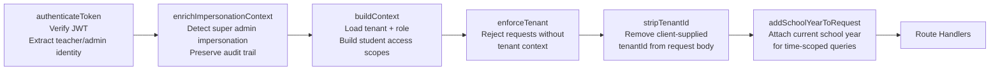

# System Architecture and Security Classification

**Document ID:** SMAP-01
**Version:** 1.0
**Date:** 2026-03-02
**Classification:** INTERNAL -- COMPLIANCE DOCUMENT
**Phase:** 27 -- Data Inventory and System Mapping

---

## 1. Overview

Tenuto.io is a multi-tenant SaaS platform for managing Israeli music conservatories. The platform enables conservatory administrators and teachers to manage students (primarily minors aged 6--18), lesson schedules, ensemble assignments, attendance tracking, bagrut (matriculation) examination records, and Ministry of Education reporting.

The technology stack consists of:

- **Backend:** Node.js + Express 4.21 REST API
- **Frontend:** React 18 SPA with TypeScript, Vite, and Tailwind CSS
- **Database:** MongoDB 6.13 (native driver, no ORM) hosted on MongoDB Atlas
- **File Storage:** AWS S3 (eu-central-1, Frankfurt) for document uploads
- **Email:** SendGrid (primary) and Gmail via Nodemailer (fallback) for transactional email
- **Hosting:** Render (backend application server + frontend static file serving)
- **Real-time:** Socket.io 4.8 for cascade deletion progress updates
- **Logging:** Pino 10.3 structured JSON logger (stdout, captured by Render)

All inter-component communication occurs over public internet with TLS encryption. There is no VPN or private network connectivity between components.

---

## 2. Component Architecture Diagram

---

## 3. Component Details

| Component | Technology | Hosting Provider | Data Classification | Data Types Processed | Security Controls |
|---|---|---|---|---|---|
| Browser | User agent | End-user device | PUBLIC (interface) / RESTRICTED (JWT in localStorage) | JWT access token, user interactions | Same-origin policy, HTTPS only |
| React Frontend SPA | React 18 + TypeScript + Vite | Render (static files) | PUBLIC | No data stored; all data fetched via API calls | CSP headers via helmet, HTTPS |
| Express API Server | Node.js + Express 4.21 | Render | SENSITIVE | ALL categories: RESTRICTED (student PII, credentials), SENSITIVE (teacher PII), INTERNAL (operational data) | helmet, express-mongo-sanitize, express-rate-limit, CORS allowlist, JWT auth (access + refresh), bcrypt password hashing (10 rounds), tenant isolation middleware, RBAC, cookie-based refresh tokens, httpOnly cookies |
| MongoDB Atlas | MongoDB 6.13 | MongoDB Atlas (cloud) | RESTRICTED | All 22 collections including minors' PII, credentials (hashed passwords, JWT refresh tokens), exam grades | Connection string auth, TLS in transit, Atlas default encryption at rest, tenant isolation via tenantId field |
| AWS S3 | Amazon S3 | AWS eu-central-1 (Frankfurt) | SENSITIVE | Uploaded documents: bagrut files (PDF, DOC, DOCX, JPG, PNG) | AWS access key auth, HTTPS transport, S3 default encryption at rest, bucket access policy |
| SendGrid | SendGrid (Twilio) | SendGrid cloud (US) | SENSITIVE | Teacher email addresses, teacher names, invitation/reset token URLs | HTTPS API transport, API key auth |
| Gmail Fallback | Google Gmail via Nodemailer | Google infrastructure | SENSITIVE | Same as SendGrid: teacher email addresses, names, token URLs | SMTP with TLS, app password auth |
| Pino Logger | Pino 10.3 | Render (stdout capture) | INTERNAL | Structured JSON logs with sensitive field redaction | Sensitive field redaction configured in Pino, Render platform log access controls |
| Socket.io | Socket.io 4.8 | Render (same server) | INTERNAL | Cascade deletion progress events (entity IDs, status updates) | Shares Express server, JWT auth on connection |

---

## 4. Security Boundary Annotations

### 4.1 External Boundary: Browser to Render

- **Protocol:** HTTPS with TLS
- **Authentication:** JWT access token in Authorization header (Bearer scheme)
- **Token storage:** JWT stored in browser localStorage (vulnerable to XSS -- see risk assessment)
- **Refresh tokens:** Sent via httpOnly cookie
- **CORS:** Allowlisted origins only (configured via FRONTEND_URL environment variable)
- **Rate limiting:** express-rate-limit applied at API level

### 4.2 Internal Boundary: Render to MongoDB Atlas

- **Protocol:** MongoDB wire protocol over TLS
- **Authentication:** Connection string with credentials (stored in MONGODB_URI environment variable)
- **Tenant isolation:** Every query includes tenantId filter enforced by middleware
- **No private networking:** Communication over public internet with TLS

### 4.3 Internal Boundary: Render to AWS S3

- **Protocol:** HTTPS via AWS SDK
- **Authentication:** AWS access key + secret key (stored in environment variables)
- **Region:** eu-central-1 (Frankfurt) -- data stays within EU
- **Encryption:** S3 default encryption at rest

### 4.4 Cross-Border Boundary: Render to SendGrid/Gmail

- **Protocol:** HTTPS API (SendGrid) / SMTP with TLS (Gmail)
- **Data transferred:** Teacher names, email addresses, invitation/password reset token URLs
- **Data residency concern:** SendGrid is US-based; Gmail uses Google global infrastructure
- **Cross-border transfer:** Personal data (teacher names and emails) exits to US/Google servers
- **DPA status:** NEEDS VERIFICATION for both services

### 4.5 Network Summary

All component-to-component communication occurs over public internet with TLS/HTTPS encryption. There are no VPN tunnels, private subnets, or dedicated network links between any components. Security relies entirely on:

1. TLS encryption in transit
2. Per-component authentication (JWT, connection strings, API keys, access keys)
3. Application-level tenant isolation

---

## 5. Middleware Security Chain

The Express API server applies a middleware chain to every authenticated route. This chain enforces authentication, tenant isolation, and request context before any route handler executes.

### Middleware Step Details

| Step | Middleware | Enforces | Failure Behavior |
|---|---|---|---|
| 1 | `authenticateToken` | Valid JWT token with correct signature and expiry | 401 Unauthorized |
| 2 | `enrichImpersonationContext` | Detects `isImpersonation` claim; preserves original super admin identity for audit logging | Pass-through (no rejection) |
| 3 | `buildContext` | Loads teacher record, extracts tenantId, builds `req.context.scopes` with `studentIds` and `orchestraIds` from `_studentAccessIds` | 403 if teacher record not found |
| 4 | `enforceTenant` | Ensures `req.context.tenantId` exists; blocks requests without tenant context | 403 Forbidden |
| 5 | `stripTenantId` | Removes any `tenantId` from `req.body` to prevent client-side tenant spoofing | Pass-through (silent strip) |
| 6 | `addSchoolYearToRequest` | Attaches the current school year for the tenant to scope time-dependent queries | Pass-through (null if no school year) |

### Exemptions

- **Auth routes** (`/api/auth`): Only `authenticateToken` + `enrichImpersonationContext` + `buildContext` (no `enforceTenant` -- login requires tenant selection first)
- **Super admin routes** (`/api/super-admin`): Separate authentication flow with `type: 'super_admin'` JWT claim
- **Cross-tenant routes**: Specific routes listed in `config/crossTenantAllowlist.js` are exempt from `enforceTenant`

---

## 6. Environment Variables and Secrets

All secrets are stored as environment variables in Render's secrets management. No secrets are committed to source control.

| Variable | Classification | Purpose |
|---|---|---|
| `MONGODB_URI` | RESTRICTED | Database connection string with credentials |
| `ACCESS_TOKEN_SECRET` | RESTRICTED | JWT access token signing key |
| `REFRESH_TOKEN_SECRET` | RESTRICTED | JWT refresh token signing key |
| `S3_ACCESS_KEY` | RESTRICTED | AWS S3 access key |
| `S3_SECRET_KEY` | RESTRICTED | AWS S3 secret key |
| `SENDGRID_API_KEY` | RESTRICTED | SendGrid API authentication |
| `EMAIL_PASS` | RESTRICTED | Gmail app password (fallback) |
| `FRONTEND_URL` | INTERNAL | CORS origin allowlist / email link base |
| `S3_BUCKET` | INTERNAL | S3 bucket name |
| `S3_REGION` | INTERNAL | S3 region identifier |
| `FROM_EMAIL` | INTERNAL | Email sender address |
| `EMAIL_USER` | INTERNAL | Gmail address for fallback |
| `PORT` | PUBLIC | Server listening port |
| `NODE_ENV` | PUBLIC | Environment flag |
| `STORAGE_MODE` | INTERNAL | File storage mode (local/s3) |

---

## 7. References

- **Data Inventory:** See `DATA-INVENTORY.md` (DBDF-01) for complete field-level collection documentation
- **Data Flow Map:** See `DATA-FLOW-MAP.md` (SMAP-02) for personal data movement tracing
- **Vendor Inventory:** See `VENDOR-INVENTORY.md` (SMAP-03, planned) for third-party service details
- **Risk Assessment:** See `RISK-ASSESSMENT.md` (RISK-01, planned) for formal risk analysis
