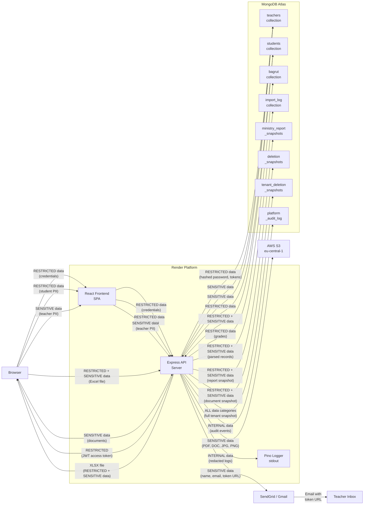

# Personal Data Flow Map

**Document ID:** SMAP-02
**Version:** 1.0
**Date:** 2026-03-02
**Classification:** INTERNAL -- COMPLIANCE DOCUMENT
**Phase:** 27 -- Data Inventory and System Mapping

---

## 1. Overview

This document traces the movement of personal data through the Tenuto.io platform, classified by sensitivity level. Its purpose is to identify every path personal data takes from collection through processing to storage and potential deletion, enabling compliance reviewers to understand the complete data lifecycle without accessing the codebase.

Data classification levels used in this document:

| Level | Description | Examples |
|---|---|---|
| **RESTRICTED** | Minors' personal data and authentication credentials | Student names, addresses, grades, hashed passwords, JWT tokens |
| **SENSITIVE** | Adult personal data and business-sensitive information | Teacher PII, Israeli ID numbers, organizational contact details |
| **INTERNAL** | Operational data not publicly visible | Schedules, attendance, configuration, audit logs |
| **PUBLIC** | Data with no privacy implications | Health check status, instrument lists |

---

## 2. Personal Data Flow Diagram

---

## 3. Flow Details

### 3.1 Authentication Flow

| Property | Value |
|---|---|
| **Flow name** | Teacher / Admin Authentication |
| **Source** | Browser (login form) |
| **Destination** | MongoDB Atlas (teachers collection) |
| **Data classification** | RESTRICTED (email, password, JWT tokens) |
| **Transport security** | HTTPS (browser to API), TLS (API to MongoDB) |
| **Authentication** | None (pre-auth flow); post-auth via JWT |
| **Notes** | Password verified against bcrypt hash (10 rounds). Access token (1h expiry) returned in response body and stored in browser localStorage. Refresh token (30d expiry) set as httpOnly cookie. Token version counter enables revocation. |

### 3.2 Student Data Flow (CRUD)

| Property | Value |
|---|---|
| **Flow name** | Student Record Management |
| **Source** | Browser (student forms) |
| **Destination** | MongoDB Atlas (students collection) |
| **Data classification** | RESTRICTED (minors' PII: names, phone, address, parent contacts) |
| **Transport security** | HTTPS (browser to API), TLS (API to MongoDB) |
| **Authentication** | JWT access token in Authorization header |
| **Notes** | All queries scoped by tenantId via middleware. Teacher access restricted to assigned students via buildContext scopes. Student names denormalized into teacher.teaching.timeBlocks[].assignedLessons[].studentName. |

### 3.3 Teacher Data Flow (CRUD)

| Property | Value |
|---|---|
| **Flow name** | Teacher Record Management |
| **Source** | Browser (teacher forms) |
| **Destination** | MongoDB Atlas (teachers collection) |
| **Data classification** | SENSITIVE (adult PII: names, phone, email, address, ID number, birth year) |
| **Transport security** | HTTPS (browser to API), TLS (API to MongoDB) |
| **Authentication** | JWT access token; admin role required for teacher management |
| **Notes** | Israeli ID number (Teudat Zehut) stored for employment/tax reporting. Credentials (hashed password, tokens) stored in same document as personal info. |

### 3.4 Bagrut Examination Flow

| Property | Value |
|---|---|
| **Flow name** | Bagrut Exam Records |
| **Source** | Browser (bagrut forms) |
| **Destination** | MongoDB Atlas (bagrut collection) + AWS S3 (documents) |
| **Data classification** | RESTRICTED (minors' exam grades, detailed grading breakdowns) |
| **Transport security** | HTTPS (browser to API), TLS (API to MongoDB), HTTPS (API to S3) |
| **Authentication** | JWT access token; teacher/admin role required |
| **Notes** | Documents (PDF, DOC, JPG, PNG) uploaded to S3 eu-central-1. Grade data includes presentations, magen bagrut, director evaluation, and final computed grade. |

### 3.5 Import Flow

| Property | Value |
|---|---|
| **Flow name** | Excel Data Import (Teachers / Students / Ensembles) |
| **Source** | Browser (Excel file upload) |
| **Destination** | MongoDB Atlas (import_log, then target collection) |
| **Data classification** | RESTRICTED + SENSITIVE (full teacher/student records from Excel) |
| **Transport security** | HTTPS (browser to API -- multer memoryStorage, no disk persistence), TLS (API to MongoDB) |
| **Authentication** | JWT access token; admin role required |
| **Notes** | Two-phase: preview (parses Excel, saves to import_log with status 'pending') then execute (by importLogId, inserts to target collection). Preview data persisted in import_log with NO cleanup policy -- full PII retained indefinitely. |

### 3.6 Export Flow

| Property | Value |
|---|---|
| **Flow name** | Ministry of Education Report Export |
| **Source** | MongoDB Atlas (multiple collections) |
| **Destination** | Browser (XLSX download) + MongoDB Atlas (ministry_report_snapshots) |
| **Data classification** | RESTRICTED + SENSITIVE (aggregated teacher and student data) |
| **Transport security** | TLS (MongoDB to API), HTTPS (API to browser) |
| **Authentication** | JWT access token; admin role required |
| **Notes** | Aggregates data across teacher, student, orchestra, and related collections. Generates 6-sheet XLSX. Snapshot saved to ministry_report_snapshots with completionPercentage. Snapshots retained indefinitely. |

### 3.7 Email Flow

| Property | Value |
|---|---|
| **Flow name** | Transactional Email (Invitations, Password Resets, Welcome) |
| **Source** | Express API Server |
| **Destination** | SendGrid (primary) or Gmail (fallback) --> Teacher inbox |
| **Data classification** | SENSITIVE (teacher name, email address, invitation/reset token URL) |
| **Transport security** | HTTPS API (SendGrid), SMTP with TLS (Gmail) |
| **Authentication** | SendGrid API key, Gmail app password |
| **Notes** | **Cross-border transfer:** Personal data (teacher names and email addresses) sent to US-based SendGrid servers or Google global infrastructure. Token URLs contain time-limited tokens. DPA status with SendGrid NEEDS VERIFICATION. |

### 3.8 File Upload Flow

| Property | Value |
|---|---|
| **Flow name** | Bagrut Document Upload |
| **Source** | Browser (file selection) |
| **Destination** | AWS S3 (eu-central-1) |
| **Data classification** | SENSITIVE (scanned documents that may contain student/exam information) |
| **Transport security** | HTTPS (browser to API via multer), HTTPS (API to S3 via AWS SDK) |
| **Authentication** | JWT access token; AWS access key for S3 |
| **Notes** | Accepted formats: PDF, DOC, DOCX, JPG, PNG. S3 region is eu-central-1 (Frankfurt) -- data stays within EU. Document URLs stored in bagrut.documents[]. |

### 3.9 Deletion Flow

| Property | Value |
|---|---|
| **Flow name** | Entity and Tenant Deletion |
| **Source** | Express API Server |
| **Destination** | MongoDB Atlas (deletion_snapshots, tenant_deletion_snapshots) |
| **Data classification** | RESTRICTED + SENSITIVE (full document snapshots before deletion) |
| **Transport security** | TLS (API to MongoDB) |
| **Authentication** | JWT access token; admin role for entity deletion, super admin for tenant deletion |
| **Notes** | Entity deletion: full document snapshot saved to deletion_snapshots. Tenant purge: ALL tenant data across all collections saved to tenant_deletion_snapshots. Snapshots retained indefinitely with NO cleanup policy. Contains complete PII copies. |

### 3.10 Logging Flow

| Property | Value |
|---|---|
| **Flow name** | Application Logging and Audit Trail |
| **Source** | Express API Server |
| **Destination** | Pino/stdout (Render captures) + MongoDB Atlas (platform_audit_log) |
| **Data classification** | INTERNAL (structured logs with sensitive field redaction) |
| **Transport security** | stdout (local), TLS (API to MongoDB for audit log) |
| **Authentication** | N/A (internal process) |
| **Notes** | Pino configured with sensitive field redaction. platform_audit_log captures super admin actions including IP addresses (classified SENSITIVE). Tenant-level admin actions not currently logged. |

### 3.11 Impersonation Flow

| Property | Value |
|---|---|
| **Flow name** | Super Admin Impersonation |
| **Source** | Super admin browser |
| **Destination** | Express API Server (generates teacher JWT) |
| **Data classification** | RESTRICTED (generates JWT with full teacher access) |
| **Transport security** | HTTPS |
| **Authentication** | Super admin JWT with `type: 'super_admin'` claim |
| **Notes** | Super admin can generate a teacher JWT with `isImpersonation: true` claim. Impersonation context preserved by enrichImpersonationContext middleware for audit trail. Grants full access to target tenant's data. |

---

## 4. Data at Rest Summary

| Storage Location | Data Classifications Present | Encryption at Rest | Access Control | Retention |
|---|---|---|---|---|
| MongoDB Atlas | RESTRICTED + SENSITIVE + INTERNAL | MongoDB Atlas default encryption at rest (AES-256) | Connection string auth + application-level tenant isolation via tenantId | No automated retention enforcement; soft-delete exists but no TTL cleanup |
| AWS S3 (eu-central-1) | SENSITIVE | S3 default server-side encryption (SSE-S3) | AWS access key auth; bucket access policy | No retention policy configured |
| Render (application logs) | INTERNAL (sensitive fields redacted by Pino) | Render platform default encryption | Render dashboard authentication | Render default log retention |
| Browser localStorage | RESTRICTED (JWT access token) | None (browser storage, plaintext) | Same-origin policy; accessible to any JavaScript on the same origin | Until manually cleared or token expiry |
| Browser httpOnly cookie | RESTRICTED (JWT refresh token) | None (browser storage) | httpOnly flag prevents JavaScript access; same-site cookie policy | 30-day expiry |

---

## 5. Data in Transit Summary

All external connections between platform components use TLS/HTTPS encryption. No data travels in plaintext over the network.

| Connection | Protocol | Encryption | Authentication Method |
|---|---|---|---|
| Browser <-> React Frontend | HTTPS | TLS 1.2+ | N/A (static files) |
| Browser <-> Express API | HTTPS | TLS 1.2+ | JWT in Authorization header (Bearer) |
| Express API <-> MongoDB Atlas | MongoDB wire protocol | TLS | Connection string credentials |
| Express API <-> AWS S3 | HTTPS | TLS 1.2+ | AWS access key + secret key (via SDK) |
| Express API -> SendGrid | HTTPS API | TLS 1.2+ | API key in request header |
| Express API -> Gmail | SMTP | STARTTLS | Gmail app password |

**Cross-border data transfers:**

| Transfer | Source Region | Destination Region | Data Types | Legal Basis |
|---|---|---|---|---|
| API -> SendGrid | Render hosting region | United States | Teacher names, email addresses, token URLs | NEEDS DOCUMENTATION (DPA verification required) |
| API -> Gmail | Render hosting region | Google global infrastructure | Same as SendGrid | NEEDS DOCUMENTATION (Google Workspace DPA) |

---

## 6. Key Risks Identified from Flow Analysis

The following risks emerge directly from analyzing the data flow paths documented above. Each is referenced to the risk assessment document (planned) for formal treatment.

### 6.1 JWT Stored in localStorage

**Flow affected:** Authentication (3.1)
**Risk:** JWT access tokens stored in browser localStorage are accessible to any JavaScript running on the same origin. An XSS vulnerability would allow an attacker to exfiltrate the access token and impersonate the user.
**Current mitigation:** Content Security Policy via helmet; refresh tokens use httpOnly cookies.
**Recommendation:** Evaluate moving access tokens to httpOnly cookies or implementing token binding (v1.6).

### 6.2 Full Document Snapshots in Deletion Collections

**Flow affected:** Deletion (3.9)
**Risk:** deletion_snapshots and tenant_deletion_snapshots contain complete copies of deleted records, including all PII (minors' data, credentials, grades). These snapshots have no retention policy and accumulate indefinitely, creating a growing store of sensitive data that persists after the user-facing record is deleted.
**Current mitigation:** None.
**Recommendation:** Implement 90-day TTL for deletion snapshots; consider encrypting snapshot data at the application level (v1.6).

### 6.3 Import Preview Data Persisted Without Cleanup

**Flow affected:** Import (3.5)
**Risk:** The import_log collection stores full parsed Excel data in previewData, potentially containing hundreds of student/teacher records with complete PII. This data persists indefinitely after import execution with no cleanup mechanism.
**Current mitigation:** None.
**Recommendation:** Purge previewData field after successful import execution; add TTL index for pending imports (v1.6).

### 6.4 Cross-Border Email Data Transfer

**Flow affected:** Email (3.7)
**Risk:** Teacher names and email addresses are sent to US-based SendGrid servers for email delivery. Under Israeli Privacy Protection Regulations, cross-border transfer of personal data requires appropriate safeguards.
**Current mitigation:** HTTPS encryption in transit.
**Recommendation:** Verify SendGrid DPA exists and covers Israeli regulatory requirements; evaluate EU-based email provider alternative; document cross-border transfer legal basis (v1.6).

### 6.5 Credentials Co-located with Personal Data

**Flow affected:** Authentication (3.1), Teacher Data (3.3)
**Risk:** Hashed passwords, JWT refresh tokens, invitation tokens, and password reset tokens are stored in the same MongoDB document as teacher personal information. A database dump or backup leak exposes both authentication credentials and personal data in a single document.
**Current mitigation:** Passwords are bcrypt-hashed (10 rounds); tokens are application-generated.
**Recommendation:** Evaluate separating credentials into a dedicated collection; implement field-level encryption for token fields (v1.6).

### 6.6 Student Name Denormalization

**Flow affected:** Student Data (3.2)
**Risk:** Student names (minors' PII) are copied into teacher records at `teaching.timeBlocks[].assignedLessons[].studentName`, creating an additional exposure surface for minors' data. If a student's name is updated, the denormalized copy may become stale.
**Current mitigation:** None.
**Recommendation:** Evaluate removing denormalized student names or implementing synchronization cleanup (v1.6).

---

## 7. References

- **System Architecture:** See `ARCHITECTURE-DIAGRAM.md` (SMAP-01) for component-level diagram and security boundaries
- **Data Inventory:** See `DATA-INVENTORY.md` (DBDF-01) for complete field-level collection documentation
- **Data Purposes:** See `DATA-PURPOSES.md` (DBDF-02) for lawful basis and retention analysis per collection
- **Minors' Data:** See `MINORS-DATA.md` (DBDF-03) for minors' data identification and handling gaps
- **Vendor Inventory:** See `VENDOR-INVENTORY.md` (SMAP-03, planned) for third-party service details
- **Risk Assessment:** See `RISK-ASSESSMENT.md` (RISK-01, planned) for formal risk analysis
